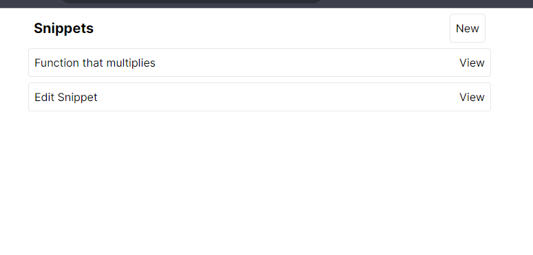
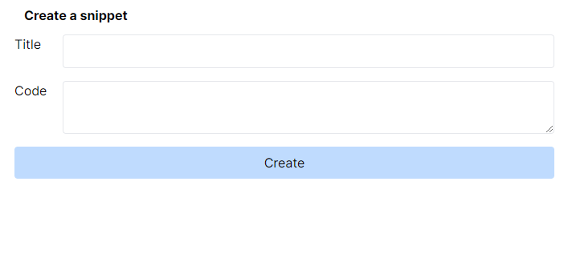
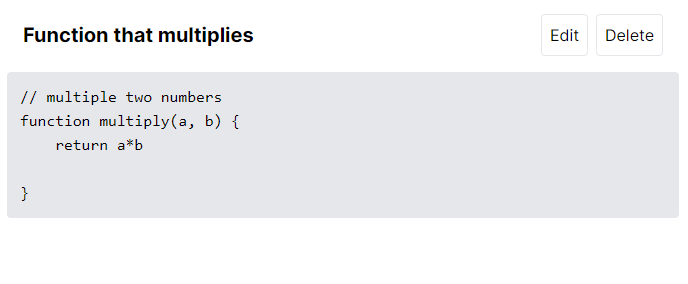
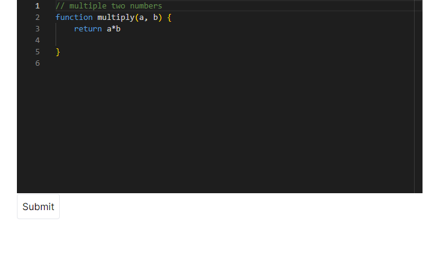

NextJS + Prisma + Monaco Editor

## Getting Started

First, run the development server:

```bash
npm run dev
```

## App

Snippet management app, has the ability to create, read, update and delete your snippet.

List View


Create Snippet


View/Delete Snippet


Update Snippet

